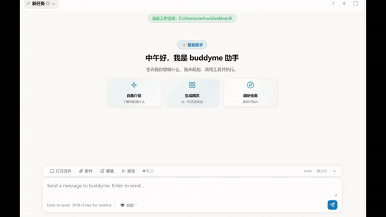

<div align="center">

**English** | [简体中文](readme.md)

# buddyMe

**BuddyMe — Build Smarter Agents**

Runtime hot-swapping across 6 major LLM providers. Layered persona, three-tier skill loading, and heartbeat memory — built for developers who need flexibility.

Multi-model hot-swap · Tool calling · Skill system · Persistent memory · Scheduled tasks

[Blog](http://49.235.53.176/) · [GitHub](https://github.com/virgo777/buddyme)

</div>

---

## 🎬 Demo

Full task walkthrough: tongue-image analysis → annotated diagram generation → Word report delivery (task decomposition / concurrent execution / auto-shown deliverables).

<p align="center">
  
</p>

<p align="center">
  Full task walkthrough: tongue-image analysis → annotated diagram generation → Word report delivery
</p>

<p align="center">
  🎬 High-res (720p, with audio):
  <a href="https://github.com/virgo777/buddyme/releases/download/demo-assets/demo.mp4">demo.mp4</a>
</p>

---

## Introduction

buddyMe is a multi-model AI agent framework written in Python. It automatically decomposes complex tasks into subtasks, then plans, executes, and verifies each one before merging the results. It ships with 25+ built-in skills, 8 tools, a complete memory system, and scheduled-task capabilities — usable as a coding assistant or a general-purpose task agent.

## 🚀 Release Notes

### v0.2.0 (2026-08-22)

This release adds three features around **scheduled-task observability** and **usage transparency**, all with zero extra token cost:

| Feature | Command | Description |
|---------|---------|-------------|
| **Session stats** | `/stats` | Token input/output for this session, task counts, top tools used, skills touched, and files generated — the agent already tracked all of this internally; now it's surfaced directly to you |
| **Daily scheduled tasks** | `/cron <HH:MM> <task>` | Fire daily at a fixed time like `09:00` (±5 min tolerance) — complements `/loop` interval cycles: "every 30 minutes" uses loop, "every day at 9am" uses cron |
| **Run history** | `/loop --history <id>` · `/cron --history <id>` | Each heartbeat run records status (success ✓ / timeout ⏱ / fail ✗) and duration, keeping the last 20 — see how background tasks are doing at a glance |

Upgrade: `pip install --upgrade .`, then start with `buddyme` and type `/help` to see the new commands.

<details>
<summary><b>Previous versions</b></summary>

- **v0.1.x** — Multi-model hot-swap, three-stage task execution, three-tier skill loading, persistent memory (decay + merge), heartbeat loop tasks, dual-protocol adaptation
</details>

<div style="background-color: #f8f9fa; padding: 18px 22px; border-radius: 8px; margin: 28px 0; border-left: 4px solid #e67e22;">
  <p style="margin: 0 0 14px 0; line-height: 1.6;">Visit the <a href="http://49.235.53.176/" style="color: #2563eb; text-decoration: none;">BuddyMe Blog</a> for the latest articles and technical deep-dives.</p>
  <p style="color: #e67e22; font-size: 1.1em; font-weight: bold; margin: 0 0 12px 0;">📚 Recommended reading</p>
  <ul style="margin: 0; padding-left: 22px; line-height: 1.9;">
    <li><a href="http://49.235.53.176/blog/heartbeat-and-loop-skill-engine-deep-dive" style="color: #2563eb; text-decoration: none;">buddyMe Heartbeat System & Loop Engine: Let AI work on its own — for free</a></li>
    <li><a href="http://49.235.53.176/blog/buddyme" style="color: #2563eb; text-decoration: none;">Deep dive: the "blind decomposition" problem in task planning and skill-aware optimization</a></li>
    <li><a href="http://49.235.53.176/blog/react-plan-and-execute-reflection" style="color: #2563eb; text-decoration: none;">ReAct vs. Plan-and-Execute vs. Reflection: essential differences and practical guidance</a></li>
  </ul>
</div>

## Core Features

- **Multi-model support** — GLM, DeepSeek, ERNIE, Qwen, MiMo; one-key runtime switching with zero interruption
- **Three-stage task execution** — Plan → subtask execution → result merging; complex tasks decompose automatically
- **Tool system** — 8 built-in tools (bash, file read/write/edit, search, glob, etc.), extensible
- **Skill system** — 25+ preset skills (API design, frontend development, Python testing, …), three-tier progressive loading, runtime hot-reload
- **Persistent memory** — user profile, conversation summaries, and history logs persist across sessions, with decay and merging
- **Scheduled tasks** — `/loop` interval cycles + `/cron` daily fixed-time, heartbeat-thread background polling with run history
- **Session stats** — `/stats` for token usage, tool-call distribution, and skill usage, all locally with zero overhead
- **Command system** — `/`-prefixed commands handled locally, consuming no LLM tokens
- **Dual-protocol adaptation** — auto-detects OpenAI-compatible / Anthropic-compatible endpoints behind one unified interface

## Supported Models

| Config name | Provider | Model | Max tokens |
|-------------|----------|-------|------------|
| `glm` | Zhipu AI | glm-5.1 | 131,072 |
| `glm_code_plan` | Zhipu AI | glm-5.1 | 390,000 |
| `deepseek` | DeepSeek | deepseek-v4-pro | 393,216 |
| `deepseek_code_plan` | DeepSeek | deepseek-v4-pro | 960,000 |
| `ernie` | Baidu Qianfan | ernie-5.1 | 65,536 |
| `xiaomi` | Xiaomi | mimo-v2-pro | 131,072 |
| `qwen` | Alibaba Tongyi | qwen3.6-plus | 65,536 |

## Installation

### Requirements

- Python >= 3.9
- pip

### From source

```bash
git clone https://github.com/virgo777/buddyme.git
cd buddyme
pip install -e .
```

## Configuration

### 1. Create the environment file

Create a `.env` file in the project root with your API keys:

```bash
cp .env.example .env
```

Example `.env`:

```env
GLM_API_KEY=your_glm_api_key
DEEPSEEK_API_KEY=your_deepseek_api_key
ERNIE_API_KEY=your_ernie_api_key
XIAOMI_API_KEY=your_xiaomi_api_key
QWEN_API_KEY=your_qwen_api_key
```

Only fill in keys for models you actually use; the rest can stay empty.

### 2. Environment variables (optional)

| Variable | Description | Default |
|----------|-------------|---------|
| `BUDDYME_MODEL` | Default model name | `glm_code_plan` |
| `BUDDYME_HOME` | User data directory | `~/.buddyme/` |
| `BUDDYME_WORKSPACE` | Workspace directory | Current directory |

## Quick Start

### CLI mode
First add the Scripts directory to your PATH:

```bash
set PATH=%PATH%;C:\Users\yourname\AppData\Roaming\Python\Python313\Scripts
buddyme
```

### Development mode

```bash
python -m buddyMe
```

You'll land in an interactive session:

```
============================================================
buddyMe — Multi-model agent + Skills
Workspace: /your/workspace
Default model: glm_code_plan
Type /help for available commands
============================================================
query:
```

## Usage Examples

### Basic conversation

```
query: Write a quicksort function in Python
```

### Complex tasks (auto-decomposed)

```
query: Create a Flask REST API in the current project with full user CRUD endpoints and unit tests
```

The agent decomposes this into: project scaffolding → model definitions → API routes → unit tests → verification.

### Switching models

```
query: /model --list               # list available models
query: /model --switch deepseek    # switch to DeepSeek
```

### Scheduled tasks

```
query: /loop 30m Check that all tests in the current project pass
query: /loop --list                # list running tasks
query: /loop --history abc12345    # run history for a task (success/fail/duration)
query: /loop --remove abc12345     # remove a task
```

### Daily fixed-time tasks (new in 0.2.0)

```
query: /cron 09:00 Summarize yesterday's conversations into memory_summary every morning
query: /cron --list                # list all daily tasks
query: /cron --history <task-id>   # view run history
```

### Session stats (new in 0.2.0)

```
query: /stats    # session token usage / top tools / skills used / files generated
```

### Memory management

```
query: /memory --show       # view current memory
query: /memory --summary    # view conversation summaries
query: /memory --update     # manually trigger memory extraction
```

## Command List

All `/` commands are processed locally and consume no tokens.

| Command | Alias | Description |
|---------|-------|-------------|
| `/help [cmd]` | `/h` | Show help |
| `/model --list` | `/m` | List available models |
| `/model --switch <name>` | | Switch model |
| `/api_key <model> <key>` | | Set API key |
| `/reset` | | Clear conversation history |
| `/exit` | `/q` | Quit |
| `/skill --list` | | List loaded skills |
| `/reload_skills` | | Hot-reload the skills directory |
| `/memory --show` | `/mem` | View user memory |
| `/memory --summary` | | View conversation summaries |
| `/memory --update` | | Manually extract memory |
| `/memory --clear --force` | | Wipe all memory |
| `/log --today` | `/history` | Today's conversation log |
| `/log --search <keyword>` | | Search conversation logs |
| `/heartbeat` | `/hb` | Heartbeat task management |
| `/loop <interval> <task>` | `/lp` | Create a scheduled task |
| `/loop --history <id>` | | Task run history (0.2.0) |
| `/cron <HH:MM> <task>` | | Create a daily fixed-time task (0.2.0) |
| `/stats` | `/st` | Session stats — tokens/tools/skills (0.2.0) |

## Built-in Tools

| Tool | Description |
|------|-------------|
| `bash` | Execute shell commands (async, timeout control, dangerous-command interception) |
| `read_file` | Read files (smart truncation for large files) |
| `write_file` | Write files (auto-creates directories) |
| `edit_file` | Exact find-and-replace editing |
| `grep` | Regex content search |
| `glob` | Filename pattern matching |
| `baidu_search` | Baidu search (Qianfan AI Search API) |
| `invoke_skill` | Skill activation |

## Built-in Skills

| Skill | Domain |
|-------|--------|
| `api-design` | API design patterns |
| `backend-patterns` | Backend development patterns |
| `frontend-design` | Frontend UI design |
| `frontend-patterns` | Frontend development patterns |
| `frontend-slides` | Frontend slide generation |
| `python-patterns` | Python design patterns |
| `python-testing` | pytest testing practices |
| `coding-standards` | Coding standards |
| `deployment-patterns` | Deployment strategies |
| `article-writing` | Documentation writing |
| `market-research` | Market research |
| `weather-skill` | Weather queries |
| `qqmail-1.0.0` | QQ Mail integration |
| `continuous-learning` | Continuous learning |
| `eval-harness` | Evaluation framework |
| `markitdown-skill` | Markdown conversion |
| `autonomous-loops` | Autonomous loop execution |
| `iterative-retrieval` | Iterative information retrieval |
| `verification-loop` | Verification loop |
| `strategic-compact` | Strategic context compaction |
| `search-first` | Search-first strategy |
| `content-hash-cache-pattern` | Content-hash caching pattern |
| `plankton-code-quality` | Code quality analysis |
| `project-guidelines-example` | Project guidelines template |
| `configure-ecc` | ECC configuration |

## Architecture Overview

```
User input
  │
  ├─ /command ──→ Command system (local processing, zero tokens)
  │
  └─ Natural language
      │
      ├─ Simple task ──→ Single LLM call + tool loop
      │
      └─ Complex task
          │
          ├─ Stage 1: Planning ──→ Inject skill metadata → LLM decomposes with existing skills in mind
          │                      Matching steps get tagged [SKILL:skill-name]
          │
          ├─ Stage 2: Subtask execution ──→ Each subtask runs its own LLM + tool loop
          │                              Pre-matched skills inject full instructions · results carried forward · typed classification
          │
          └─ Stage 3: Result merging ──→ Subtask results stitched into the final output
```

### System prompt construction

The system prompt is assembled dynamically from four layers:

1. **SOUL.md** — Persona core
2. **IDENTITY.md** — Role definition (80% coding assistant + 20% life assistant)
3. **AGENT.md** — Behavior contract (tool rules, memory management, safety constraints)
4. **Tool schemas** — Dynamic descriptions of registered tools

### Directory layout

```
buddyMe/
├── agent_moudle/          # Core agent logic
├── anthropic_standard/    # LLM clients (dual-protocol adaptation)
├── cmd_library/           # Command system
│   └── builtin/           # Built-in commands (system/skill/memory/loop)
├── initspace/             # Initialization & context building
│   ├── brain/             # Persona & behavior templates
│   └── memorys/           # Memory storage
├── llm_moudle/            # Model configuration management
├── skill_library/         # Skill library
│   └── skills/            # 25+ preset skills
├── tool_moudle/           # Tool modules
└── utils/                 # Utility functions
```

## Dependencies

```
httpx          # HTTP client
rich           # Rich terminal rendering
python-dotenv  # Environment variable loading
```

## License

MIT
